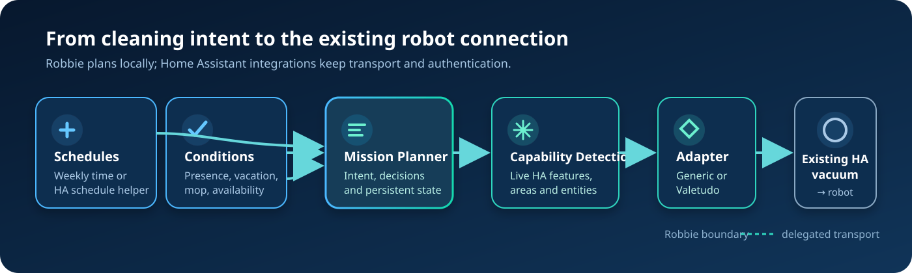
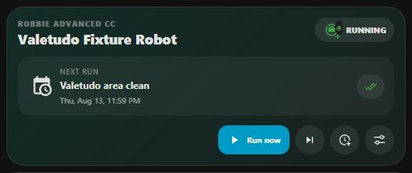
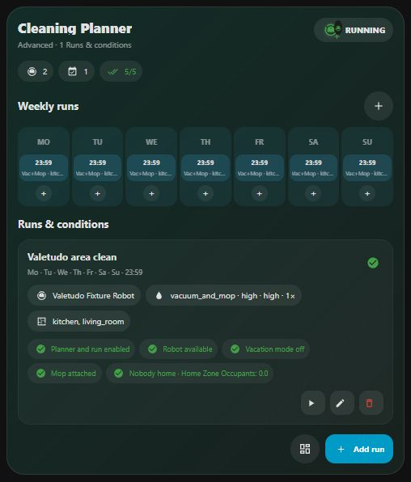
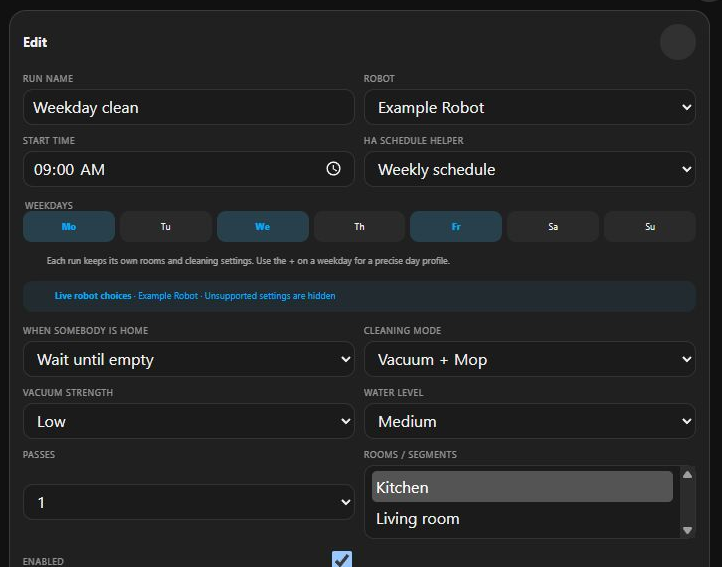
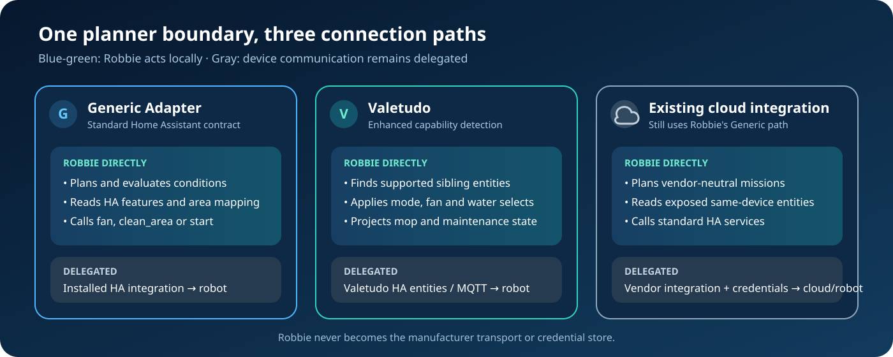

# Robbie Advanced Cleaning Control

<p align="right"><a href="../../README.md">English</a> · <strong>Deutsch</strong></p>

<p align="center">
  
</p>

<p align="center">
  <a href="https://github.com/MrCharly169/robbie-advanced-cleaning-control/actions/workflows/validate.yml"></a>
  <a href="https://github.com/MrCharly169/robbie-advanced-cleaning-control/releases/tag/v2026.8.0b11"></a>
  <a href="https://github.com/MrCharly169/robbie-advanced-cleaning-control/stargazers"></a>
  <a href="https://github.com/MrCharly169/robbie-advanced-cleaning-control/releases"></a>
  <a href="#hacs-als-benutzerdefiniertes-repository"></a>
  <a href="../../hacs.json"></a>
  <a href="../../LICENSE"></a>
</p>

**Plane Reinigungsmissionen lokal für Saugroboter, die bereits in Home Assistant vorhanden sind.**

Robbie ist kein neuer Hersteller-Cloud-Connector. Robbie ist ein lokaler,
herstellerneutraler Missionsplaner mit Dashboard für vorhandene `vacuum.*`-
Entitäten. Eine Mission beschreibt, *was* unter welchen Bedingungen gereinigt
werden soll; ein Adapter übersetzt diese Absicht in die Fähigkeiten, die Home
Assistant bereits bereitstellt.

> **Release-Status:** Für Robbie gibt es ein stabiles Release und eine aktiv
> entwickelte Beta-Linie. Stable ist die sicherere Standardwahl. Beta-Releases
> enthalten die neuesten Änderungen an Card und Planer, können sich aber noch
> ändern. Das Manifest bestimmt die installierte Version; das Release-Badge oben
> schließt Vorabversionen ein.

## Für wen ist Robbie gedacht?

Robbie richtet sich an Home-Assistant-Nutzer, die:

- bereits einen oder mehrere funktionierende Saugroboter als HA-Entitäten haben;
- Wochenmissionen, Anwesenheits-/Urlaubsregeln, Räume und Reinigungsprofile an
  einer Stelle verwalten möchten;
- verschiedene Hersteller oder lokale und cloudgestützte Integrationen mischen;
- Home-Assistant-Entitäten und -Services einem weiteren Cloud-Konto vorziehen.

Robbie ersetzt nicht die Integration, die den Roboter mit Home Assistant
verbunden hat. Solange der Roboter nicht als funktionierende `vacuum.*`-Entität
vorhanden ist, kann Robbie ihn nicht anbinden.

## Was Robbie tut — und was nicht

| Robbie tut | Robbie tut nicht |
|---|---|
| Wiederkehrende Missionen und einmaligen Planerzustand in Home Assistant speichern | Sich bei einer Hersteller-Cloud anmelden |
| Planer-Aktivierung, Urlaub, Verfügbarkeit, Wischaufsatz und Anwesenheit auswerten | Valetudo, MQTT oder eine Herstellerintegration ersetzen |
| Verfügbare Räume, Lüfter- und Wasserwerte soweit implementiert erkennen und fehlende Selektoren auslassen | Raumreinigung, Wischen, Wassersteuerung oder Wiederholungen versprechen, die der aktive Adapter nicht ausführt |
| Home-Assistant-Entitäten und -Services als öffentliche Schnittstelle verwenden | Herstellerthemen, Tokens oder proprietäre Cloud-Payloads veröffentlichen |
| Aktuellen Planerstatus, nächsten Lauf, Bedingungen und letzten Entscheidungsgrund anzeigen | Eine dauerhafte Datenbank aller vergangenen Läufe führen |



Zeitpläne und Bedingungen entscheiden, *wann* eine Mission infrage kommt. Der
Missionsplaner verwaltet Absicht und Entscheidungsgründe. Capability Detection
erkennt, was Home Assistant aktuell bereitstellt. Der Adapter wendet nur
unterstützte Optionen an und überlässt die Gerätekommunikation anschließend der
vorhandenen Home-Assistant-Integration.

## Screenshots

Die Screenshots stammen aus dem Disposable-Home-Assistant-Lab des Repositorys
und seinem Browser-Regressions-Fixture für die echte Card, jeweils mit neutralen
Testdaten. Es werden weder eine produktive Home-Assistant-Instanz noch ein
Roboterkonto oder eine Hersteller-Cloud verwendet; gerendert wird die produktive
Card-Ressource.

| Simple Card | Advanced Card |
|---|---|
|  |  |
| Nächster Lauf, Bereitschaft und Starten/Überspringen/Verschieben. | Sieben-Tage-Übersicht, Profile und nachvollziehbare Bedingungen. |

| Missionseditor | Badge je Roboter |
|---|---|
|  |  |
| Zeitpunkt, Anwesenheitsverhalten, Roboter, Räume und unterstützte Profilwerte bearbeiten. | Natives 36-px-Badge mit Live-Status und optionaler Zeit des nächsten Laufs. |

## Schnellstart

1. Prüfe, ob der Roboter in Home Assistant 2026.6 oder neuer bereits als
   funktionierende `vacuum.*`-Entität vorhanden ist.
2. [Füge dieses Repository zu HACS hinzu](#hacs-als-benutzerdefiniertes-repository),
   Typ **Integration**, installiere Robbie und starte Home Assistant neu.
3. Öffne **Einstellungen → Geräte & Dienste → Integration hinzufügen**, suche
   nach **Robbie Advanced Cleaning Control** und durchlaufe die fünf Schritte.
4. Füge die Card im Dashboard-Editor hinzu. Im Storage-Modus registriert Robbie
   die Frontend-Ressource automatisch.
5. Beginne mit einer neutralen Wochenmission, prüfe erkannte Räume/Profilwerte
   und aktiviere danach Anwesenheits- oder Urlaubsverhalten. Beim Generic Adapter
   sollte Modus Vacuum und Durchläufe 1 bleiben, sofern seine unten dokumentierten
   Ausführungsgrenzen nicht bewusst akzeptiert werden.

Minimale Card:

```yaml
type: custom:robbie-advanced-cleaning-card
mode: simple
```

Minimales Badge, wenn genau ein Planer/Roboter automatisch erkannt wird:

```yaml
type: custom:robbie-vacuum-badge
navigation_path: /lovelace/cleaning
```

Setze `entry_id`, `status_entity` oder `vacuum_entity` nur, wenn die automatische
Erkennung mehrdeutig ist, beispielsweise bei mehreren Planern und Robotern.

## Installation

### HACS als benutzerdefiniertes Repository

Dieses Projekt wird derzeit als **benutzerdefiniertes** HACS-Repository
installiert. Das Badge „HACS Custom“ behauptet nicht, dass Robbie im
HACS-Standardkatalog enthalten ist.

1. Öffne in HACS das Menü oben rechts und wähle **Benutzerdefinierte Repositories**.
2. Trage
   `https://github.com/MrCharly169/robbie-advanced-cleaning-control` ein.
3. Wähle **Integration** und anschließend **Hinzufügen**.
4. Öffne **Robbie Advanced Cleaning Control**, wähle ein Release und lade es
   herunter. Nimm das neueste Nicht-Prerelease, wenn du nicht bewusst Beta testest.
5. Starte Home Assistant neu.

Alternativ öffnet dieser [Home-Assistant-Link](https://my.home-assistant.io/redirect/hacs_repository/?owner=MrCharly169&repository=robbie-advanced-cleaning-control&category=integration)
den HACS-Repository-Dialog.

HACS liest die Integration aus `custom_components/robbie_advanced_cc`.
Release-Assets heißen `robbie-advanced-cc-v<VERSION>.zip`; **Release downloads**
in der Badge-Leiste zählt Downloads von GitHub-Release-Assets, nicht HACS-
Installationen, Nutzer oder Geräte.

### Manuelle Installation

1. Lade unter [GitHub Releases](https://github.com/MrCharly169/robbie-advanced-cleaning-control/releases)
   ein Asset namens `robbie-advanced-cc-v<VERSION>.zip` herunter.
2. Entpacke es so, dass in der Home-Assistant-Konfiguration diese Datei existiert:
   `custom_components/robbie_advanced_cc/manifest.json`.
3. Starte Home Assistant neu.
4. Füge Robbie unter **Einstellungen → Geräte & Dienste** hinzu.

Kopiere nicht nur den Repository-Stammordner und benenne den Ordner
`robbie_advanced_cc` nicht um.

## Integration und Frontend einrichten

Der Einrichtungsassistent erstellt einen logischen Planer für Wohnung, Etage
oder Roboterflotte. Er fragt nach:

- einer oder mehreren vorhandenen `vacuum.*`-Entitäten;
- optionalen Anwesenheitsentitäten (`person`, `device_tracker`, `binary_sensor`,
  `input_boolean`, `zone`, numerische Sensoren/Helfer und Zähler);
- einem optionalen Urlaubs-`input_boolean`;
- einer optionalen ersten Mission, Wochenzeit oder einem vorhandenen
  `schedule.*`-Helfer;
- live erkannten Raum-/Profilwerten für die erste Mission;
- optionalem Benachrichtigungsrouter, Routenhelfer, To-do-Bindung und Dashboardpfad.

Nach der Einrichtung bearbeitest du Verbindungen und gespeicherte Missionen
unter **Einstellungen → Geräte & Dienste → Robbie Advanced Cleaning Control →
Konfigurieren**.

### Frontend-Ressource

Das kanonische JavaScript-Modul lautet immer:

```text
/robbie_advanced_cc/cleaning-control.js
```

- **Storage-Dashboards:** Robbie registriert oder migriert diese Ressource
  automatisch und zeigt einmalig einen Dashboard-Hinweis.
- **YAML-Ressourcenmodus:** Füge sie manuell als JavaScript-Modul hinzu:

  ```yaml
  lovelace:
    resources:
      - url: /robbie_advanced_cc/cleaning-control.js
        type: module
  ```

`/robbie_advanced_cc/robbie-advanced-card.js` ist nur ein Kompatibilitätsloader.
Verwende für neue Dashboards die kanonische URL.

## Card und Badge

### Simple Card

Die Simple Card ist die tägliche Ansicht. Sie zeigt Planerstatus, nächste
Mission, Bereitschaft und schmale Aktionen für Jetzt starten, Einmal
überspringen und 60 Minuten verschieben. Advanced öffnet das Control Center,
ohne die gespeicherte Dashboardkonfiguration zu ändern.

### Advanced Card

Die Advanced Card beziehungsweise das Control Center ergänzt:

- eine Sieben-Tage-Übersicht;
- Bedingungs-Chips mit aktuellen Werten je Mission;
- Erstellen, Bearbeiten, Aktivieren/Deaktivieren und Entfernen;
- roboterbezogene Raum-/Segment-, Modus-, Lüfter- und Wasserwerte, soweit
  bereitgestellt, sowie auf 1–3 begrenzte Durchlauf-Metadaten;
- sofortige Aktualisierung nach einem Roboterwechsel.

Raum-, Lüfter- und Wasserregler werden ausgelassen, wenn Robbie keine passenden
Werte erkennt. Modus besitzt mindestens den portablen Standard `vacuum`, und
Durchläufe bietet immer 1–3 an. Wichtige aktuelle Grenze: `passes` wird
gespeichert/angezeigt, aber von keinem Adapter als Wiederholungsbefehl ausgeführt;
der Generic Adapter wendet außerdem keine beliebigen verwandten Modus- oder
Wasser-Selects an. Die Card verwendet bei einer mit `de` beginnenden HA-Sprache
Deutsch, sonst Englisch. Animationen beachten die Reduced-Motion-Einstellung.

Advanced als gespeicherte Standardansicht:

```yaml
type: custom:robbie-advanced-cleaning-card
mode: advanced
```

### Badge je Roboter

`custom:robbie-vacuum-badge` verwendet das native 36-px-Badge von Home
Assistant. Es zeigt Station, Schlafen, Reinigen, Rückfahrt, Pause, Warten,
Urlaub, Fehler und Nicht verfügbar. In der Station kann es den nächsten Lauf
anzeigen. Aktivieren öffnet `navigation_path`.

Für einen bestimmten Roboter in einem Multi-Roboter-Planer:

```yaml
type: custom:robbie-vacuum-badge
vacuum_entity: vacuum.example_robot
navigation_path: /lovelace/cleaning
```

## Missionen, Wochenpläne und Bedingungen

Eine Mission enthält Name, Zielroboter, Wiederholung, optionale Räume/Segmente,
ein portables Reinigungsprofil, Guards und Ankündigungsvorlauf. Missionen
beschreiben die gewünschte Reinigung; Adapter übersetzen nur Profilfelder, für
die sie eine Implementierung besitzen. Gespeicherte Absicht beweist nicht, dass
jeder Wert an den Roboter gesendet wurde.

Wochentage mit lokaler Startzeit sind der portable Standard. Alternativ kann
eine Mission einen vorhandenen `schedule.*`-Helfer verwenden. Dessen Wechsel von
off zu on löst die Mission aus; `next_event` liefert die nächste Laufzeit.

Die feste Entscheidungsreihenfolge lautet:

1. Mission aktiviert (der Schalter Planer aktiviert steuert separat die
   automatische Planung);
2. Urlaub;
3. Verfügbarkeit des Roboters;
4. erforderlicher Wischaufsatz, soweit erkannt;
5. Anwesenheitsverhalten;
6. bereit zum Start.

Das vollständige Missionsobjekt und Services zeigt das
[neutrale Beispiel](../../examples/missions.yaml).

### Anwesenheit, Urlaub, Warten, Auslassen und Verschieben

| Situation | Von Robbie implementiertes Verhalten |
|---|---|
| Jemand ist zu Hause + `wait` | Die fällige Mission bleibt wartend und startet, sobald alle Anwesenheitsquellen ein leeres Zuhause melden. Wartende Missions-IDs werden neustartfest gespeichert. |
| Jemand ist zu Hause + `allow` | Die Mission darf sofort starten. |
| Jemand ist zu Hause + `skip` | Dieses Vorkommen wird ohne Roboterstart verbraucht. |
| Anwesenheit unbekannt/nicht verfügbar | Fail-safe als belegt behandelt. `wait` startet nicht nur, weil eine Quelle verschwunden ist. Numerisch bedeutet `0` leer, größer `0` belegt. |
| Urlaub ist aktiv | Der globale Urlaubsstatus unterdrückt Ankündigungen und geplante Ausführung. Nach Urlaubsende plant Robbie das nächste berechtigte Vorkommen; es gibt keinen Urlaubs-Rückstau. |
| Roboter nicht verfügbar | Der Standard-Guard verschiebt um 60 Minuten. Der Entscheidungsgrund bleibt sichtbar. |
| Wischaufsatz ausdrücklich als fehlend gemeldet | Wisch- und Saug-/Wischmissionen verwenden den konfigurierten Wisch-Guard (standardmäßig blockieren). Ein unbekannter Status gilt nicht als bestätigt fehlend. |
| **Einmal überspringen** | Merkt sich die nächste Missions-ID neustartfest und verbraucht genau ein Vorkommen ohne Gerätebefehl. |
| **Verschieben** | Speichert eine Ersatzzeit. Die Card verwendet 60 Minuten; der Service akzeptiert 1–1440 Minuten. |
| Adapterbefehl schlägt fehl | Robbie setzt Fehlerstatus/-grund und gibt den Fehler weiter; ein erfolgreicher Start wird nicht vorgetäuscht. |

Planerstatus-, Nächste-Mission- und Letzte-Entscheidung-Entitäten halten das
aktuelle Ergebnis nachvollziehbar. Warten, Verschieben und Skip-once überleben
einen Neustart. Robbie führt derzeit **kein** dauerhaftes Auditprotokoll aller
alten blockierten oder ausgelassenen Läufe. Nutze dafür bei Bedarf HA-Verlauf
oder eigene Automationen.

## Adapter und Kompatibilität



| Pfad | Erkennung und Missionsausführung | Direkt von Robbie | Weiterhin extern |
|---|---|---|---|
| **Generic Home Assistant Adapter** | Für jeden verwalteten, nicht als Valetudo erkannten Roboter. Liest `supported_features`, HA-Vacuum-Area-Mapping, Lüfterstufen und verwandte Entitäten desselben Geräts. Setzt die Standard-Lüfterstufe, wenn unterstützt, ruft für bekannte Bereiche `vacuum.clean_area` auf, sonst `vacuum.start`. Allgemeine Modus-/Wasser-Selects und `passes` werden nicht ausgeführt. | Planung, Guards, Capability-Projektion und diese Standard-HA-Serviceaufrufe. | Installierte Vacuum-Integration: Transport und Authentifizierung. |
| **Valetudo-Erweiterung** | Wenn Entity-ID oder Friendly Name `valetudo` enthält. Zusätzliche Geschwistererkennung für Modus, Lüfter, Wasser, Wischaufsatz, Segmente/Karten, Locate-/Auto-Empty-Signale und Wartungssensoren. Wendet exakte Valetudo-ähnliche Modus-/Lüfter-/Wasser-Geschwister-Selects vor Generic Start/Bereich an. `passes` wird nicht ausgeführt. | Erweiterte Erkennung, implementierte Profilübersetzung und Wisch-/Wartungsprojektion. | Valetudos vorhandene MQTT-discovered HA-Entitäten und MQTT-Transport. Robbie verbindet sich nicht mit MQTT. |
| **Vorhandene Cloud-Integration** | Verwendet den Generic Adapter. Raum-/Profilentitäten desselben Geräts können zur Darstellung erkannt werden; ausgeführt werden nur die oben genannten Generic-Standardaktionen. | Derselbe herstellerneutrale Planer und dieselbe HA-Servicegrenze. | Hersteller-Cloud, Kontoanmeldung, Tokens, Limits und Gerätefunktionen. |

Capability Detection erfindet keine Unterstützung. Erkannte Karten-, Locate-
oder Auto-Empty-Signale sind Diagnose-/Erkennungsinformationen, solange keine
dokumentierte Robbie-Card, Entität oder ein Service eine Aktion anbietet. Die
öffentlichen Robbie-Services sind aktuell nur `add_mission`, `remove_mission`,
`run_next`, `skip_next` und `postpone_next`.

## Aktualisieren und deinstallieren

### Aktualisieren

- **HACS:** Robbie in HACS öffnen, **Aktualisieren** oder **Erneut herunterladen**
  wählen, gewünschtes Stable/Beta auswählen, HA neu starten und Dashboard laden.
- **Manuell:** `custom_components/robbie_advanced_cc` durch den Ordner des neuen
  Release-Assets ersetzen und Home Assistant neu starten.

Die Frontend-URL bleibt bei Updates unverändert. Füge kein `?v=` manuell hinzu.

### Deinstallieren

1. Robbie Cards und Badges aus Dashboards entfernen.
2. Den Robbie-Konfigurationseintrag unter **Einstellungen → Geräte & Dienste** löschen.
3. Robbie über HACS entfernen oder bei manueller Installation ausschließlich
   `custom_components/robbie_advanced_cc` löschen.
4. `/robbie_advanced_cc/cleaning-control.js` aus den Dashboard-Ressourcen
   entfernen, falls der Eintrag verbleibt.
5. Home Assistant neu starten.

Robbie löscht oder benennt ausgewählte Vacuum-, Anwesenheits-, Urlaubs-,
Zeitplan-, Benachrichtigungs-, Routen- oder To-do-Entitäten nie um. Aktuell gibt
es keinen Removal-Hook für die Planerdatei
`.storage/robbie_advanced_cc.<entry_id>`. Bearbeite `.storage` nicht bei
laufendem Home Assistant und erstelle vor manueller Bereinigung ein Backup.

## Local-first, Zugangsdaten und Datenschutz

- Robbie fragt nach Entity-IDs und Servicebindungen, nicht nach Hersteller-
  Benutzernamen, Passwörtern, API-Schlüsseln oder Tokens.
- Cloud-Zugangsdaten verbleiben in der vorhandenen HA-Integration, die die
  Roboterverbindung besitzt.
- Produktionscode enthält keinen Hersteller-Cloud-Client, keine Telemetrie und
  keine Analytics-Aufrufe. Er stellt die Card lokal bereit und ruft HA-Services auf.
- HA-Storage enthält Missionen und einmaligen Planerzustand. Konfigurationseinträge
  enthalten gewählte Entity-IDs, Benachrichtigungsbindungen und Dashboardpfad.
- Ein optionaler Benachrichtigungsrouter kann Nachrichten dorthin senden, wohin
  *dein Script* sie sendet; dieses externe Verhalten kontrolliert Robbie nicht.
- Diagnosen schwärzen Benachrichtigungsscript und Route, enthalten aber weiterhin
  ausgewählte Entity-IDs und Adapterfähigkeiten. Vor dem Teilen prüfen.

## FAQ und Fehlerbehebung

### Verbindet sich Robbie direkt mit Roboter oder Cloud?

Nein. Installiere und konfiguriere zuerst die passende HA-Vacuum-Integration
beziehungsweise Valetudo/MQTT. Robbie plant anhand ihrer Entitäten.

### Wird Hersteller X unterstützt?

Es gibt keine Hersteller-Whitelist. Eine funktionierende Standard-`vacuum.*`-
Entität kann den Generic Adapter nutzen. Räume und Profilregler hängen davon ab,
was diese Entität und verwandte HA-Entitäten bereitstellen. Nur Valetudo besitzt
heute einen eigenen erweiterten Adapter.

### Warum fehlt ein Raum-, Lüfter-, Wasser- oder Wischregler?

Robbie lässt nicht erkannte Raum-, Lüfter- und Wasserwerte aus. Prüfe `supported_features`,
HA-Vacuum-Area-Mapping, Lüfterstufen und Select-/Sensor-Entitäten desselben
Geräts. Eine Mission ohne erkannte Bereiche fällt auf vollständiges
`vacuum.start` zurück und täuscht keine Raumreinigung vor.

### Warum startete ein geplanter Lauf nicht?

Prüfe in dieser Reihenfolge: Planer aktiviert, Urlaub, Roboterverfügbarkeit,
Wischaufsatz und Anwesenheit. Sieh danach in **Letzte Entscheidung** und die
Bedingungs-Chips der Advanced Card. Unbekannte Anwesenheit gilt absichtlich als
belegt.

### Card oder Badge fehlt

1. Home Assistant 2026.6+ bestätigen und nach Installation neu starten.
2. In Dashboard-Ressourcen genau ein JavaScript-Modul mit
   `/robbie_advanced_cc/cleaning-control.js` prüfen.
3. Im YAML-Ressourcenmodus manuell hinzufügen.
4. Danach Browsercache aktualisieren.
5. Bei mehreren Planern `entry_id` oder `status_entity` setzen.

### Wo finde ich hilfreiche Diagnosen?

**Einstellungen → Geräte & Dienste → Robbie → Diagnose herunterladen**. Entity-
IDs vor dem Anhängen prüfen. Niemals HA-Zugriffstokens, Herstellerzugangsdaten,
Cookies, Auth-Dateien aus `.storage` oder vollständige Backups veröffentlichen.

### Warum kamen Modus, Wasserstufe oder Durchläufe nicht am Roboter an?

Der Valetudo-Adapter wendet seine exakten Modus-/Lüfter-/Wasser-Geschwister-
Selects an. Der Generic Adapter wendet nur HA-Standard-Lüfterstufe,
Bereichsreinigung und Start an. Wiederholte Durchläufe sind bei beiden Adaptern
aktuell nur Metadaten. Das ist eine bekannte Funktionsgrenze und kein erfolgreich
ausgeführter Gerätebefehl.

## Support, Sicherheit und Beiträge

- [Fehler melden](https://github.com/MrCharly169/robbie-advanced-cleaning-control/issues/new?template=bug_report.yml)
- [Funktion vorschlagen](https://github.com/MrCharly169/robbie-advanced-cleaning-control/issues/new?template=feature_request.yml)
- Vor Sicherheitsmeldungen [SECURITY.md](../../SECURITY.md) lesen.
- Beiträge folgen [CONTRIBUTING.md](../../CONTRIBUTING.md) und dem
  [Code of Conduct](../../CODE_OF_CONDUCT.md).

Berichte sollten Adapter, anonymisierte Vacuum-Entity-ID, HA-/Robbie-Version,
reproduzierbare Schritte und geprüfte Diagnosen enthalten — niemals Zugangsdaten.

## Lizenz und freiwillige Unterstützung

Robbie Advanced Cleaning Control ist Open Source unter der
[MIT-Lizenz](../../LICENSE). Private und kommerzielle Nutzung sind nach Maßgabe
der Lizenz einschließlich Copyright-/Hinweis- und Gewährleistungsbedingungen
erlaubt. Es gibt keine separate kommerzielle Lizenz.

Freiwillige Unterstützung ist keine Lizenzgebühr. Eine verifizierte Sponsoring-
oder Buy-Me-a-Coffee-URL liegt noch nicht vor; deshalb wird kein Spenden-Badge
und kein Zahlungslink veröffentlicht. Nach Verifizierung kann freiwillige
Unterstützung Entwicklung, Gerätekompatibilität, Tests und Dokumentation fördern.

## Entwicklerdetails

Home-Assistant-Entitäten und -Services bilden den öffentlichen Runtime-Vertrag.
Das Manifest ist die einzige Versionsquelle; Release-ZIPs bewahren die HACS-
Struktur. Technische Details:

- [Architektur](../ARCHITECTURE.md)
- [Unterstützte Basis](../BASELINE.md)
- [Entwicklung und Disposable-HA-Lab](../DEVELOPMENT.md)
- [Regressionsmatrix](../REGRESSION_MATRIX.md)
- [Release-Verlauf](../../CHANGELOG.md)
- [Vorgeschlagene GitHub-Metadaten und manuelle Einstellungen](../GITHUB_METADATA.md)
